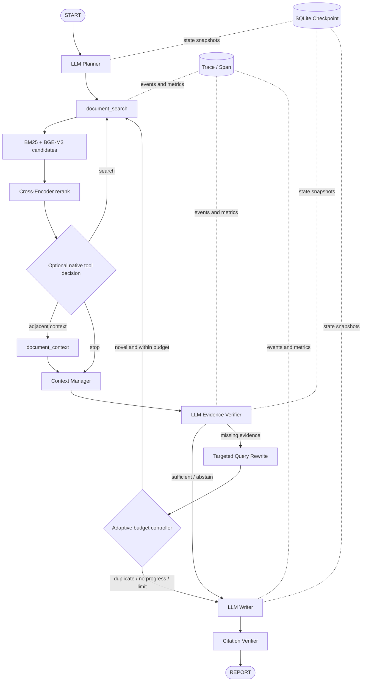

# AgentFlow

An evidence-grounded research agent with bounded planning, adaptive retrieval, citation-aware generation, and reproducible evaluation.

AgentFlow 是一个面向本地技术文档的单 Agent 研究系统。它使用 LangGraph 编排计划、工具检索、证据验证、受控补检索和带引用写作，并用持久化状态、运行轨迹和冻结评测集约束整个执行过程。

```text
Question -> Plan -> Search -> Context -> Verify -> Rewrite/Stop -> Write -> Cite
```

## Highlights

- **有界 Agent 工作流**：Planner、Retriever、Verifier、Writer 通过 LangGraph 条件边协作，最多执行有限轮补检索。
- **可解释检索实验**：16 篇中英文文档、3 种切块、3 种 Embedding、BM25、RRF、Query Expansion 与 Cross-Encoder 均有独立消融。
- **可靠工具执行**：`document_search` 与 `document_context` 具备结构化输入输出、超时、重试、错误分类和调用记录。
- **上下文工程**：证据去重、Token 预算、单段截断、全局裁剪和溢出内容持久化在写作前完成。
- **可恢复与可观测**：SQLite Checkpoint、Trace/Span、模型 Token、组件耗时和停止原因贯穿完整运行。
- **后端交付**：FastAPI、Server-Sent Events、文档增删、运行恢复、Docker Compose 与 pgvector 后端。

## Architecture



系统定位为**单 Agent、有状态、工具增强的条件工作流**，不是 Multi-Agent。语言模型负责生成计划、判断证据缺口和组织答案；Harness 负责验证结构、执行工具、限制循环、管理上下文和决定失败路径。

## Key Results

### Frozen V2 retrieval benchmark

V2 包含 16 篇中英文文档和 80 个问题意图：20 个开发意图、40 个冻结可回答意图、20 个压力意图。每个意图均有中英文版本，因此检索开发集执行 40 个 Query Variant，冻结检索集执行 80 个 Query Variant。`section_aware` 索引包含 934 个 Chunk。

所有配置只在开发集上选择；冻结集不参与切块、Embedding、融合方法或重排器选择。80 个意图均经过来源证据复核，冻结数据 SHA-256 为 `5a6d83f12bb7dd21a21582c2076447c643265496f49e56809adb3afdc797c0ef`。

| Frozen pipeline | All-gold Hit@1 | Hit@3 | Hit@5 | MRR@10 | Candidate all-gold | Mean retrieval latency |
| --- | ---: | ---: | ---: | ---: | ---: | ---: |
| BM25 | 41.3% | 48.8% | 50.0% | 0.465 | 53.8% @50 | 10.7 ms |
| BGE-M3 Vector | 60.0% | 78.8% | 81.3% | 0.720 | 100.0% @50 | 192.7 ms |
| RRF | 38.8% | 53.8% | 62.5% | 0.500 | 100.0% union | 203.8 ms |
| RRF + Query Expansion | 37.5% | 55.0% | 63.8% | 0.494 | 100.0% union | 199.5 ms |
| **RRF + Query Expansion + Cross-Encoder** | **85.0%** | **95.0%** | **95.0%** | **0.914** | **97.5% @30** | **9.65 s** |

同一 V2 语料上的 V1 风格基线 `fixed_char + bge-small-zh-v1.5 + BM25` 的 Hit@5 为 43.8%、MRR@10 为 0.361。该对照说明多语言 Embedding 与重排对双语检索有效，也显示 Cross-Encoder 在 CPU 上带来明显延迟成本。

### Frozen end-to-end run

60 道主语言问题通过 DeepSeek 执行完整 Planner、Retriever、Verifier、Writer 流程，其中 44 道可回答、16 道不可回答或安全压力题。

| Metric | Vector | Cross-Encoder quality path |
| --- | ---: | ---: |
| Answerable all-gold Hit@5 in final context | 79.5% | **86.4%** |
| Gold claim citation coverage | 81.4% | **90.9%** |
| Citation ID validity | 100.0% | 100.0% |
| Unanswerable abstention rate | **100.0%** | 93.8% |
| Numerical-conflict phrase rate | 75.0% | **100.0%** |
| Mean end-to-end latency | 8.20 s | 23.04 s |
| Total model tokens | 351,099 | 326,988 |

Cross-Encoder 结果经 AI 辅助逐题来源复核：55 题完整、3 题部分正确、2 题失败。该复核不是独立人工盲审。生成时的问题文本与冻结版本逐条一致；Gold 修正后复用了原生成输出并重新计分，完整来源记录见 [评测说明](docs/evaluation.md)。

## Capability Groups

### 1. Agent Orchestration

- LangGraph `StateGraph` 管理 Planner、Retriever、Verifier、Query Rewriter 和 Writer。
- Planner 输出经过 Pydantic 校验的 1 至 3 个初始检索步骤。
- Verifier 输出必要要点、证据映射、缺失要点和补充查询。
- Adaptive Controller 根据查询新颖度、新增证据、耗时和调用预算决定继续或停止。
- 可选原生 `tool_calls` 允许模型在首轮检索后补搜或读取相邻上下文，最多两次动作。

### 2. Retrieval

- PDF、Markdown 和纯文本解析；固定字符、递归 Token、章节感知三种切块。
- BM25、Sentence Transformers、候选并集、Reciprocal Rank Fusion、线性加权与 Cross-Encoder。
- Query/Passage 编码分离，支持模型专属 Query Instruction 和隔离向量索引。
- `document_context(evidence_id, window)` 仅能读取当前命中证据的同文档邻块。
- 本地 NumPy 与 PostgreSQL/pgvector 两种持久化路径。

### 3. Reliability

- 工具 Schema 校验、超时、指数退避重试和错误分类。
- Planner、Verifier、Writer 失败路径显式记录；无证据时确定性拒答。
- 最大查询数、最大补检索数、总检索时长和无进展轮数形成硬边界。
- SQLite Checkpoint 支持进程重启后恢复 pending node，并保证完成任务幂等恢复。

### 4. Context Engineering

- 估算问题、计划和证据 Token，占用前预留生成预算。
- 按证据 ID 与规范化文本去重。
- 控制单证据上限、总上下文上限和排序裁剪。
- 被裁剪的完整证据可写入运行工作目录，避免无痕丢失。

### 5. Observability

- 统一 `run_id`、`trace_id`、Span 父子关系和节点事件。
- 汇总模型调用、工具调用、逻辑检索次数、停止原因、Token 与可配置成本。
- SQLite 持久化 Trace，并可镜像 JSONL。
- Server-Sent Events 推送节点级执行事件。

### 6. Evaluation & Deployment

- 冻结双语评测集、Gold Span 到 Chunk 的动态映射和 SHA-256 校验。
- Hit/Recall@K、MRR@10、nDCG@10、候选召回与 Bootstrap 95% 置信区间。
- 68 项本地回归测试和 7 项 Harness 韧性测试。
- FastAPI、文档索引管理、运行查询/恢复、Docker Compose 和 pgvector。

## Quick Start

### Install

Python 3.10+：

```bash
python -m venv .venv
python -m pip install -r requirements.lock.txt
```

Windows 激活环境：

```powershell
.venv\Scripts\Activate.ps1
python -B scripts/run_local_tests.py
```

### Configure the model

创建 `.env`，不要提交真实密钥：

```env
AGENTFLOW_LLM_API_KEY=your_api_key
AGENTFLOW_LLM_BASE_URL=https://api.deepseek.com
AGENTFLOW_LLM_MODEL=deepseek-chat
AGENTFLOW_LLM_VERIFIER_ENABLED=true
```

接口遵循 OpenAI-compatible Chat Completions 格式，不限定模型提供商。

### Prepare the V2 benchmark

项目不分发第三方论文 PDF。按照 [语料说明](data/raw/README.md) 获取 Manifest 中的 16 个文件后：

```bash
python -B scripts/prepare_v2_corpus.py --strategy all
python -B scripts/build_v2_indexes.py
python -B scripts/audit_v2_eval.py --require-verified
python -B scripts/audit_v2_indexes.py
```

完整 3×3 Embedding 与冻结检索实验：

```bash
python -B scripts/run_v2_retrieval_suite.py
```

本地模型路径可通过该脚本的 `--bge-small-zh-path`、`--bge-small-en-path`、`--bge-m3-path` 和 `--reranker-path` 参数传入。

### Run one research task

设置 V2 运行配置：

```env
AGENTFLOW_CORPUS_VERSION=v2
AGENTFLOW_RETRIEVAL_BACKEND=local
AGENTFLOW_V2_CHUNKING_STRATEGY=section_aware
AGENTFLOW_V2_EMBED_MODEL=bge-m3
AGENTFLOW_V2_RETRIEVAL_METHOD=cross_encoder
```

```bash
python -B scripts/run_demo.py --online
```

## API Example

```bash
python -m uvicorn agentflow.api.app:app --host 0.0.0.0 --port 8000
```

打开 `http://127.0.0.1:8000/docs`，主要接口包括：

- `POST /research`：同步研究任务。
- `POST /research/stream`：流式节点事件。
- `POST /retrieval/search`：独立检索。
- `POST /retrieval/index`、`DELETE /retrieval/documents/{id}`：受管理员密钥保护的索引管理。
- `GET /runs/{id}`、`GET /runs/{id}/trace`、`POST /runs/{id}/resume`：状态、轨迹与恢复。

Docker：

```bash
docker compose up --build -d
```

## Project Structure

```text
agentflow/
  agents/       LangGraph nodes, state, controller and context manager
  tools/        typed document tools and execution runtime
  retrieval/    chunking, indexes, fusion, reranking and storage backends
  generation/   evidence writer and citation validation
  storage/      SQLite checkpoints and traces
  api/          FastAPI service
  evals/        V2 dataset schema, mapping and ranking metrics
data/           manifests, frozen benchmark and local-data instructions
reports/v2/     frozen experiment summaries and auditable details
scripts/        corpus, index, evaluation and demo entry points
tests/          local regression coverage
```

## Current Limitations

- Cross-Encoder 在 CPU 上平均约 9.65 秒，仅适合作为高质量路径；低延迟场景应使用 BGE-M3 Vector。
- 16 篇文档与 80 个问题意图仍是中等规模研究语料，不能代表通用互联网检索。
- 逐题答案复核为 AI 辅助来源核对，并非独立人工盲审。
- 原生模型工具选择只有小规模 pilot，不作为默认能力或核心结果。
- Docker Compose 已在 Docker Desktop 4.91.0 上完成镜像构建、API/pgvector 健康检查、实际检索请求与容器重启恢复冒烟；尚未进行并发压测、备份恢复或生产安全审计。

## Documentation

- [Architecture and runtime](docs/architecture.md)
- [Evaluation protocol and complete results](docs/evaluation.md)
- [Corpus and benchmark preparation](docs/v2_corpus_and_evaluation.md)
- [Retrieval service and index management](docs/retrieval_service.md)
- [Tool calling](docs/tool_calling.md)
- [Docker deployment](docs/docker_deployment.md)

## License

Code is released under the [MIT License](LICENSE). Third-party documents retain their original licenses and are not redistributed.
